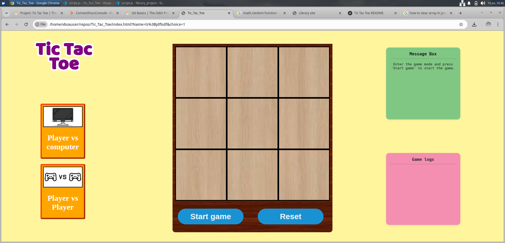

---

## 💻 How to Play

1. **Choose game mode**  
   Click on:
   - "Player vs Computer" or  
   - "Player vs Player"

2. **Enter player details**  
   Provide name(s) and token choice (1 = O, 2 = X)

3. **Start the game**  
   Use the "Start game" button to begin playing.

4. **Take turns**  
   Players click on any empty box to place their token.

5. **Win or Draw**  
   - A player wins by aligning 3 tokens in a row, column, or diagonal.  
   - If the board fills without a winner, the game is a draw.

6. **Reset anytime**  
   Press the "Reset" button to restart the game.

---

## 📸 Preview

## ⚙️ Technical Notes

- `gameboard` is a 3×3 array tracking the board state.
- `Gameboard()` manages moves, turn tracking, and outcome detection.
- Win/draw conditions are checked after every move.
- AI randomly chooses from available moves.
- DOM elements update dynamically for messages and visual feedback.

---

## 📌 To Do

- [ ] Implement smarter AI (Minimax)
- [ ] Add animations or sound effects
- [ ] Make layout responsive on mobile
- [ ] Track wins across multiple rounds

---

## 📄 License

This project is licensed under the [MIT License](https://opensource.org/licenses/MIT).  
Free to use, modify, and distribute.

---

## 🙌 Acknowledgments

- Token icons from [Material Design Icons](https://materialdesignicons.com/)
- Built using vanilla JavaScript, HTML5, and CSS3

---

